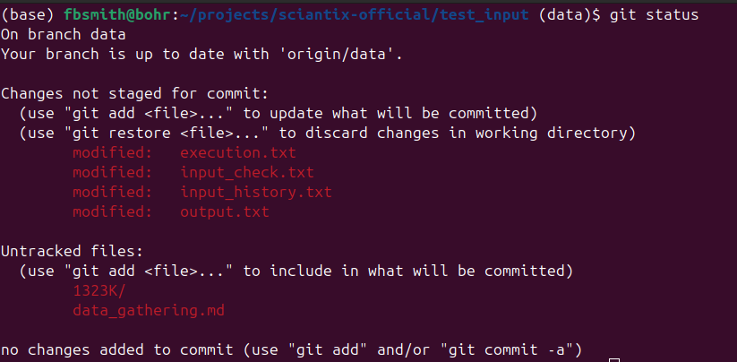
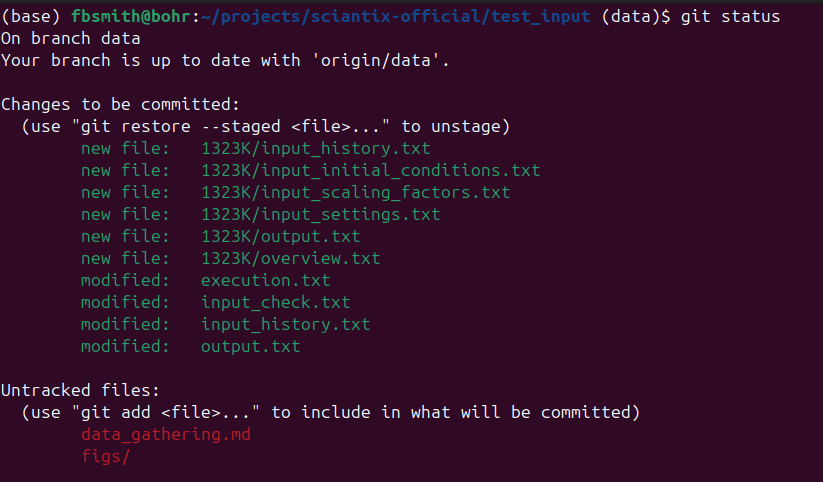
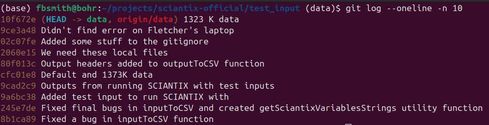

# SciantixML Project: Data Gathering

In this project, we're going to gather data that's going to be fed to a
Machine Learning Model, specifically a NeuralODE. This is going to help
us explain Fission Gas Release phenomena and enable the industry to
better model fuel performance.

## Compiling an executable

Firstly, we need to compile an executable to run our code. Sciantix has
2 ways of being compiled: standalone, or ready to be coupled. For our
data acquisition, we're going to be compiling and running Sciantix in
standalone mode.

We begin by opening the Terminal in VS Code. You should be open to the
root directory of our project, which is ```sciantix-official```. Run
these commands to remove an existing ```build``` directory, create an
new one, and change into it. If using Linux, those are the following
commands.

```bash
rm -r build
mkdir build
cd build
```

If using Windows, then these commands.

```bash
rmdir build
mkdir build
cd build
```

You will notice that there are a few differences between the Linux and
Windows operating systems. You will become use to them as you do more
scientific computing in the future.

Next we will use CMake to create build instructions for our compiler.
Execute these commands on Linux

```bash
cmake ..
```

and these ones on Windows. Note that this assumes you have already
installed MinGW. If you have not, then make sure you install the latest
version of MinGW. You can check to make sure you have MinGW installed
correctly by running these commands.

```bash
gcc --version
g++ --version
mingw32-make --version
```

Once that all works, run this command.

```bash
cmake -G "MinGW Makefiles" ..
```

Now that all the instructions are in place to compile Sciantix, we can
actually compile it. That can be done with this command.

```bash
cmake --build .
```

or this one on Linux

```bash
make
```

or this one on Windows

```bash
mingw32-make
```

any of them should get you the right thing. Once this is done, you
should have an executable. Check by listing the contents in the
```build``` directory.

```bash
ls
```

On Linux, the executable will be ```sciantix.x```, and on Windows, the
executable will be ```sciantix.exe```.

## Running Sciantix to get Data

Once we have an executable to run Sciantix with, it'll be most
convenient to move it to the ```test_input``` directory.

```bash
mv sciantix.x ../test_input
```

or

```bash
mv sciantix.exe ../test_input
```

Move to the ```test_input``` directory.

```bash
cd ../test_input
```

Now you'll make some changes to one of the input files in the
```test_input``` directory. This will likely be the
```input_history.txt``` file, but may also be the
```input_initial_conditions.txt``` file. In this example, I'm going to
change the temperature of the simulation from 1273 K to 1323 K, an
increase in 50 K.

Once you've made those changes, run Sciantix with this command.

```bash
./sciantix.x .
```

or 

```bash
./sciantix.exe .
```

It should run without any errors. Open the ```output.txt``` file to
confirm everything ran properly. If everything ran properly, make a new
directory to store the run data. Mine will be ```1323K``` because that's
the significant change from the default/baseline conditions.

```bash
mkdir 1323K
cp input_* output.txt overview.txt 1323K
```

You have successfully run Sciantix and collected data!

## Using git

After generating some data files, it's important to track them with
```git``` so our work is saved and can be shared with other
collaborators on our project.

The first ```git``` command that we'll run is ```git status```.

```bash
git status
```

This command shows us what files have been modified, added, or deleted
since our last commit.



We see that all these files are red. For ```git``` to save the changes,
we need to add them to the staging area. We do that by using the
```git add``` command. Since we want everything we save at one time to
be related to each other, I'm only going to add files that relate to
generating 1323 K data from Sciantix.

```bash
git add execution.txt
git add input_check.txt
git add input_history.txt
git add output.txt
git add 1323K
```

After adding all those files to the staging area, we can check to make
sure they've been added properly by using ```git status``` again.



We can see that all the files that are staged for a commit now appear
in green text. Also note that when you add a directory to be staged by
```git```, all the contents of the directory get added to the staging
area. This way we didn't need to manually add each file. Since I'm
working on this markdown file and I've added a couple of figures, I'm
not going to add those and they are going to show up in red font still.

Now that we've added the files we want to save, we're going to save them
by executing a command called ```git commit```

```bash
git commit -m "1323 K data"
```

A ```commit``` is what ```git``` calls the save state of our project
repository. The text in quotes after the ```-m``` are the contents of
the commit message. This should tell anyone looking at it what changes
were made in the particular commit. For us, we ran Sciantix and
generated data at 1323 K, so our commit message reflects that. It's good
practice to commit often so we're making small changes at a time rather
than a large change or several small changes all at once.

Before we do anything else with our changes, we need to make sure our
version of the project is up-to-date with all the commits that our
collaborators are making. We do that by executing the ```git pull```
command.

```bash
git pull
```

Normally it pulls recent commits and applies them to your project
repository without any problems. If you've made some changes to the same
files as your collaborators, then you may need to manage some conflicts
between the files. Open up VS Code and it will show you what conflicts
need to be addressed. It's usually good practice to ```pull``` before
you start working so you have the latest changes.

Now that we're all up to date, the last thing to do is ```push``` our
changes to the rest of the world so our collaborators can see what
commits we've made.

```bash
git push
```

We can check the commit history with this useful command.

```bash
git log --oneline -n 10
```

This will show us a log of the most recent commits, with each commit
only being on one line and only the 10 most recent commits being shown.
Here, we can see that our most recent commit has been successfully
pushed to ```origin/data```, the remote branch that all the
collaborators of this project are working on.



Congratulations! With that, we have successfully gathered data from
Sciantix and committed it!
